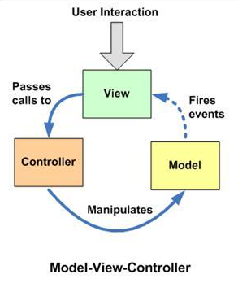
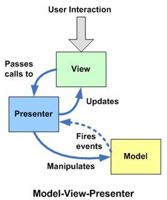

# Javascript Design Pattern II
## Describe types of MV* Pattern, and some existing popular libraries
- MVC (Model-View-Controller)
- MVP (Model-View-Presenter)
- MVVM (Model-View-ViewModel)

## MVC Pattern
MVC is an architectural design pattern that encourages improved application organization through a separation of concerns. It enforces the isolation of business data (Models) from user interfaces (Views), with a third component (Controllers) traditionally managing logic and user-input.



**Model** is where the application’s data objects are stored. The model doesn’t know anything about views and controllers. When a model changes, typically it will notify its observers that a change has occurred.

**View** typically observes a model and is notified when model changes, allowing the view to update itself.

View is what's presented to the users and how users interact with the app. The view is made with HTML, CSS, JavaScript and often templates.

Users are able to interact with views and this includes the ability to read and edit (i.e get or set the attribute values in) models. As the view is the presentation layer, we generally present the ability to edit and update in a user-friendly fashion. 

### Templating

Below we can see two examples of HTML templates. One implemented using the popular Handlebars.js framework and another using Underscore's templates.

Handlebars.js:
```html
<li class="photo">
  <h2>{{caption}}</h2>
  
  <div class="meta-data">
    {{metadata}}
  </div>
</li>
```

Underscore.js Microtemplates:
```html
<li class="photo">
  <h2><%= caption %></h2>
  "/>
  <div class="meta-data">
    <%= metadata %>
  </div>
</li>
```

**Controller** are an intermediary between models and views which are classically responsible for updating the model when the user manipulates the view.

To summarize, the MVC pattern brings modularity to application developers and it enables:
- Reusable and extendable code.
- Separation of view logic from business logic.
- Allow simultaneous work between developers who are responsible for different components (such as UI layer and core logic).
- Easier to maintain.

## MVP Pattern
Model-view-presenter (MVP) is a derivative of the MVC design pattern which focuses on improving presentation logic.



If MVC and MVP are different it is because the C and P do different things. In MVP, the P observes models and updates views when models change. The P effectively binds models to views, a responsibility which was previously held by controllers in MVC.

The benefit of this change from MVC is that it increases the testability of our application and provides a more clean separation between the view and the model. This isn't however without its costs as the lack of data binding support in the pattern can often mean having to take care of this task separately.

## MVVM Pattern
MVVM (Model View ViewModel) is an architectural pattern based on MVC and MVP, which attempts to more clearly separate the development of user-interfaces (UI) from that of the business logic and behavior in an application. To this end, many implementations of this pattern make use of declarative data bindings to allow a separation of work on Views from other layers.

To give a brief initial example, we can look to the JavaScript MVVM framework KnockoutJS for how it allows the definition of a ViewModel and its related bindings in markup:

**ViewModel:**
```javascript
var aViewModel = {
  contactName: ko.observable("John")
};
ko.applyBindings(aViewModel);
```
**View:**
```html
<p><input id="source" data-bind="value: contactName, valueUpdate: 'keyup'" /></p>
<div data-bind="visible: contactName().length > 10">
    You have a really long name!
</div>
<p>Contact name: <strong data-bind="text: contactName"></strong></p>
```
Our input text-box (source) obtains it's initial value from contactName, automatically updating this value whenever contactName changes. As the data binding is two-way, typing into the text-box will update contactName accordingly so the values are always in sync.

**Recap: The View and the ViewModel**

Views and ViewModels communicate using data-bindings and events. As we saw in our initial ViewModel example, the ViewModel doesn’t just expose Model attributes but also access to other methods and features such as validation.

Our Views handle their own user-interface events, mapping them to the ViewModel as necessary. Models and attributes on the ViewModel are synchronized and updated via two-way data-binding.

Triggers (data-triggers) also allow us to further react to changes in the state of our Model attributes.

**Recap: The ViewModel and the Model**

Whilst it may appear the ViewModel is completely responsible for the Model in MVVM, there are some subtleties with this relationship worth noting. The ViewModel can expose a Model or Model attributes for the purposes of data-binding and can also contain interfaces for fetching and manipulating properties exposed in the view.

## MVC Vs. MVP Vs. MVVM


In MVC, the View sits on top of our architecture with the controller beside it. Models sit below the controller and so our Views know about our controllers and controllers know about Models. Here, our Views have direct access to Models. Exposing the complete Model to the View however may have security and performance costs, depending on the complexity of our application. MVVM attempts to avoid these issues.

In MVP, the role of the controller is replaced with a Presenter. Presenters sit at the same level as views, listening to events from both the View and model and mediating the actions between them. Unlike MVVM, there isn’t a mechanism for binding Views to ViewModels, so we instead rely on each View implementing an interface allowing the Presenter to interact with the View.

MVVM consequently allows us to create View-specific subsets of a Model which can contain state and logic information, avoiding the need to expose the entire Model to a View. Unlike MVP’s Presenter, a ViewModel is not required to reference a View. The View can bind to properties on the ViewModel which in turn expose data contained in Models to the View. As we’ve mentioned, the abstraction of the View means there is less logic required in the code behind it.

## Frameworks
- [AngularJS](https://angularjs.org/) - MVC
- [Backbone.js](http://backbonejs.org/) - MVP
- [Vue.js](https://vuejs.org/) - MVVM

# References:
- https://addyosmani.com/resources/essentialjsdesignpatterns/book/#whatisapattern

